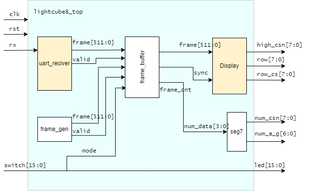
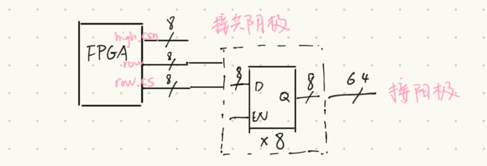
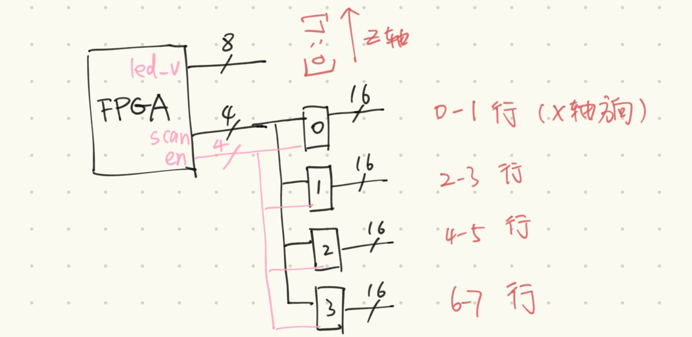
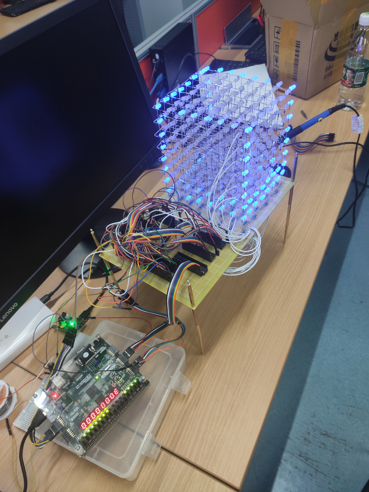

## 介绍

作为课程实验项目，计划使用FPGA实现一个8*8\*8的光立方。

因为不能进行软件编程（非单片机），而使用verilog实现复杂效果较为复杂。因此采取的方案为在上位机(PC)上生成动画，通过串口将每帧的数据传输给FPGA，FPGA负责解析数据，并驱动光立方显示动画。

## 总体设计 

- 上位机

  - 生成动画(python)(未实现, 使用[888光立方视频制作教程-优酷](https://v.youku.com/v_show/id_XMTUzMzc3OTQ4NA==)作者提供的动画文件)
  - 通过串口传输数据(python)

- FPGA

  - **串口接收模块(uart_reciver)**

    按字节接收数据，接收8*8B=64B，构成一帧。

    波特率要求：大于30(FPS) x 64B x 10 = 19200。使用115200

    内部实现了一个uart_rx模块用于接收一个字节

  - 生成默认的帧动画(frame_gen)

    未使用串口时，根据算法生成简单的默认动画

    *p.s 可以修改为使用block memory存放一小段动画，效果应该更好*

  - 缓冲区(Buffer)

    每帧时间，将一帧存储下来（来自Reciver或frame_gen），用于Display模块显示

    提供一个sync信号，用于“垂直同步”，即清空Display扫描计数器

  - **显示模块(Display)**

    生成行、列、层扫描信号，驱动光立方显示指定帧

- 电路设计

  由于价格因素，选择了方案一。但方案二电路更简洁，verilog实现也更容易

  - 方案一：使用8个8位触发器

    

  - 方案二：使用4个4-16解码器
  
    

## 元件清单

| 材料名                  | 数量 |
| ----------------------- | ---- |
| **雾状LED**             | 512  |
| **74HC573(8位锁存器)**  | 8    |
| ULN2803                 | 1    |
| 洞洞板18*30cm           | 1    |
| MB-102电源              | 1    |
| 100Ω电阻                | 64   |
| 20p插座                 | 9    |
| 面包板                  | 1    |
| 杜邦线                  | 若干 |
| 22AWG导线线崽           | 若干 |
| usbA-usbA线             | 1    |
| 电烙铁 焊锡丝等焊接设备 | 1    |
| 六角铜柱                | 8    |
| 排母                    | 若干 |

## 效果

